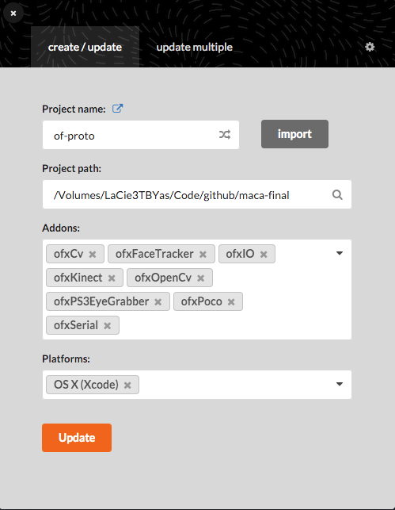

# maca-final

The openframeworks app requires several different addons:

1. [ofxIO](https://github.com/bakercp/ofxIO)
2. ofxKinect (required for the libusb driver), *included by default on openframeworks core*
3. ofxPoco *(included by default)*
4. [ofxSerial](https://github.com/bakercp/ofxSerial) 
5. ofxOpenCv *(included by default)*
6. [ofxCv](https://github.com/kylemcdonald/ofxCv)
7. [ofxPS3EyeGrabber](https://github.com/bakercp/ofxPS3EyeGrabber)
8. [ofxFaceTracker](https://github.com/kylemcdonald/ofxFaceTracker)

FIXME: automatic install of all addons using setup.py file

### Installing the addons
You can either run the `setup.py` or manually download each addon and put it in your openframeworks addons folder.

#### Using setup.py

1. Open the `setup.py` with a text editor and set the `OF_ROOT` variable to your openframeworks installation folder. In my case, it is `/Volumes/LaCie3TBYas/Code/c++/of_v0.10.0_osx_release` so I will change it like this:
`OF_ROOT="/Volumes/LaCie3TBYas/Code/c++/of_v0.10.0_osx_release"`

1. open a terminal window and `cd` into the main folder of this repo (maca-final)

2. run `python setup.py`
